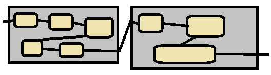
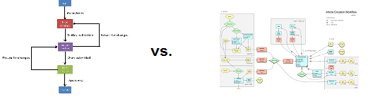
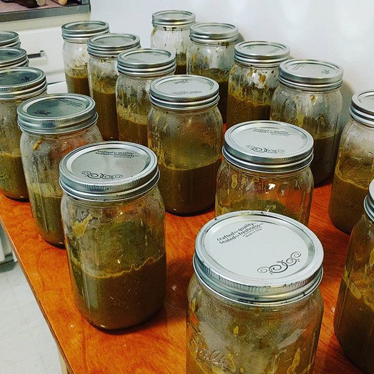
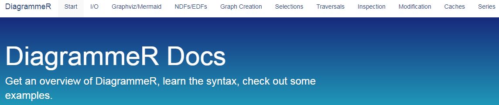
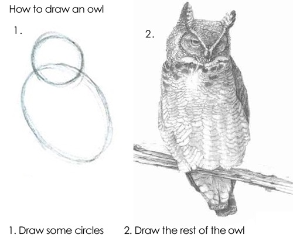

```{r setup, include=FALSE}
library(DiagrammeR)
library(dplyr)
library(magrittr)

options(stringsAsFactors = FALSE)
knitr::opts_chunk$set(echo = TRUE)
```

# Background

## Me

- no coursework in CS; graph theory
- not even intesive self-study
- but I like R
- and I have the internet


# What's the deal?

## Workflows

Work tends to go through a flow of steps.

How can we visualize this?

Micro$oft Visio? 

Can we programmatically generate this? 

## What do I want?

- people work in a tabular format to describe process
- import table to R
- ???
- workflow diagram output



## Bonus: multiple views of a single data source

One data source, multiple views

e.g. 

- simple diagram for external use
- high detail, complex, for internal use




# Example Data

## mealslurry



## mealslurry

```{r, echo=FALSE}
mealslurry <- read.csv("../mealslurry.csv")
```


Since I can't use department data ... I'll use the process of making [mealslurry](mealslurry.com)

```{r, echo = FALSE}
mealslurry %>% select(top.level.process, process) %>% distinct %>% as_tibble()
```

## mealslurry data.frame

Column names represent what it would be called coming from a departmental process document (a so-called RACI table, Responsible, Accountable, Consulted, Informed)

```{r, echo = FALSE}
mealslurry %>% str
```

# R Code

## `DiagrammeR`


package that uses Graphviz, mermaid, + .js libraries to make graph plots in R


## Sweet, there's great documentation



http://rich-iannone.github.io/DiagrammeR/


## Let's get started!

```{r, eval = FALSE, echo = TRUE}
create_nodes(nodes = mealslurry$process)

```

## Let's get started!

```{r, eval = FALSE, echo = TRUE}
create_nodes(nodes = mealslurry$process)

```
 
```r
Error in create_nodes(nodes = eat$process) : 
 could not find function "create_nodes"
```
 


## Old documentation! :(

<blockquote class="imgur-embed-pub" lang="en" data-id="NWcktFE" data-context="false"><a href="//imgur.com/NWcktFE">View post on imgur.com</a></blockquote>
<script async="" src="//s.imgur.com/min/embed.js" charset="utf-8"></script>

## My process

piecing together documentation from the [github page readme](https://github.com/rich-iannone/DiagrammeR), a couple vignettes, and the manual


## First moment of puzzlement

There doesn't seem to be documentation on how to go from tabular --> graph

Or ways to represent metadata over a set of nodes (like defining a group of connected nodes being part of a process), even thought it's present in Graphviz / DOT

A lot of functions serve to manipulate graph format data.


## Graphviz / DOT

The majority of documentation / writing I encountered seemed to be using R as a Graphviz / DOT parser -- writing a markup language and generating plots.

Here's the actual Graphviz page: https://graphviz.org/

## Graphviz example


# Resisting the urge to just use R to write DOT

*Learning to use the package ...*

## So, let's build up a graph

`node_df + edge_df + create_graph = graph`

Taking a subset of the larger process

```{r}
cooking <- mealslurry %>% filter(top.level.process == "cooking")
```


## `node_df`

```{r}
n_cooking_tasks <- length(cooking$task.definition)

cooking_nodes <- create_node_df(n = n_cooking_tasks,
                             label = cooking$task.definition, 
                             type = cooking$process, # not sure what this is
                             # defining my own var
                             top_level_process = cooking$top.level.process) 
```


## `edges_df`

```{r}
cooking_edges <- create_edge_df(from = seq_len(n_cooking_tasks - 1), 
                             to = 2:n_cooking_tasks)
```


## `create_graph`

```{r}
cooking_graph <- create_graph(nodes_df = cooking_nodes,
                              edges_df = cooking_edges)
```


## `render_graph`


```{r}
render_graph(cooking_graph)
```


## `render_graph`


```{r}
render_graph(cooking_graph, layout = "kk")
```


## `render_graph`


```{r}
render_graph(cooking_graph, layout = "circle")
```


## `output = visNetwork`

```{r, eval = FALSE}
render_graph(cooking_graph, output = "visNetwork", layout = "circle")
```

... see more exploraton HTML for demo


# What's next

## Drawing the owl




